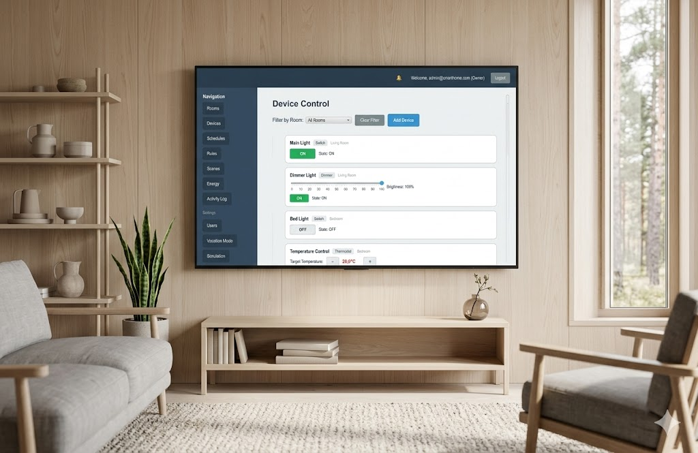

# SmartHome Orchestrator

[](https://github.com/jku-win-se/teaching-2026.ss.prse.braeuer.team4/actions/workflows/Continuous%20Integration.yaml)
[](https://github.com/jku-win-se/teaching-2026.ss.prse.braeuer.team4/actions/workflows/Continuous%20Integration.yaml)



## Überblick über das Projekt

Der **SmartHome Orchestrator** ist eine JavaFX-Desktop-Anwendung zur Verwaltung eines
(simulierten) Smart Homes — **ein System für alle Geräte** statt einer App pro Hersteller.
Benutzer organisieren virtuelle Geräte in Räumen, steuern sie manuell, automatisieren sie
über Regeln, Zeitpläne und Szenen, überwachen den Energieverbrauch und verwalten Benutzer
mit unterschiedlichen Rollen.

Was den Orchestrator ausmacht:

- **Herstellerunabhängig** – ein System für alle Geräte
- **Konfliktfrei** – Geräte spielen zusammen, ohne sich zu widersprechen
- **Energie-Transparenz** – Verbrauch pro Gerät, Raum und Haushalt
- **Eigene Automatisierung** – persönliche Regeln, Szenen und Urlaubsmodus
- **Zuverlässig & testbar** – läuft von selbst, im Hintergrund

Wesentliche Funktionen:

- **Identität & Rollen** – Registrierung, Login, Owner-/Member-Berechtigungen, Einladungen
- **Struktur** – Räume und virtuelle Geräte anlegen, umbenennen, löschen
- **Steuerung** – Schalter, Dimmer, Thermostate, Jalousien und Sensoren bedienen
- **Automatisierung** – Regeln (IF-Trigger-THEN-Action), Zeitpläne, Szenen, Vacation Mode
- **Monitoring** – Activity-Log, Energie-Dashboard, In-App-Benachrichtigungen
- **Erweiterung** – optionale MQTT-Integration für physische Geräte, Tagessimulation

Technisch handelt es sich um einen mehrschichtigen Monolithen (JavaFX-UI → Service-Schicht
→ PostgreSQL), wobei zu jedem Dienst eine In-Memory-Mock-Variante für Tests und Demobetrieb
existiert. Details siehe [Systemarchitektur](./docs/system-architecture.md).

## Team

Praktikum Software Engineering – SS 2026, Team 4.

| Mitglied | Schwerpunkt |
|---|---|
| **Gruber Manuel** | Service-Layer-Architektur (Mock-/JDBC-Restrukturierung, `ServiceRegistry`), Zeitpläne, Energie-Dashboard, MQTT-Integration, Regel-Konflikterkennung sowie CI/Build & Qualitätssicherung (JaCoCo, PMD, JavaDoc-Hosting) |
| **Li Xinyue** | Regel-Engine (`RuleService`, `RuleEvaluator`, `RuleValidator`), Automatisierung, In-App-Benachrichtigungen und Szenen mit JDBC-Persistenz |
| **Möseneder Simon** | Räume- & Geräteverwaltung (anlegen/umbenennen/löschen), CSV-Export, Tagessimulation, Vacation Mode und Benutzerhandbuch |

## Umgesetzte Anforderungen

Die funktionalen Anforderungen **FR-01 bis FR-21 sind vollständig umgesetzt**. Die
Rückverfolgbarkeit zu den User Stories ist in der
[User-Stories-Dokumentation](./docs/user-stories.md) abgebildet.

| FR | Anforderung | Status |
|----|-------------|:------:|
| FR-01 | Registrierung mit eindeutiger E-Mail/Passwort | ✅ |
| FR-02 | Login / Logout | ✅ |
| FR-03 | Räume anlegen / umbenennen / löschen | ✅ |
| FR-04 | Virtuelle Geräte hinzufügen (Typ + Name) | ✅ |
| FR-05 | Geräte umbenennen / entfernen | ✅ |
| FR-06 | Geräte manuell steuern (Schalter/Dimmer/Thermostat/Jalousie/Sensor) | ✅ |
| FR-07 | Echtzeit-Status der Geräte in der UI | ✅ |
| FR-08 | Activity-Log (Zeitstempel, Gerät, Actor) | ✅ |
| FR-09 | Wiederkehrende Zeitpläne | ✅ |
| FR-10 | Regeln (IF-Trigger-THEN-Action) | ✅ |
| FR-11 | Zeit-, Schwellwert- und ereignisbasierte Trigger | ✅ |
| FR-12 | In-App-Benachrichtigungen bei Regelausführung/-fehler | ✅ |
| FR-13 | Rollen & Berechtigungen (Owner/Member) | ✅ |
| FR-14 | Energie-Dashboard (Gerät/Raum/Haushalt, Tag/Woche) | ✅ |
| FR-15 | Erkennung von Zeitplan-/Regelkonflikten | ✅ |
| FR-16 | CSV-Export von Activity-Log / Energieverbrauch | ✅ |
| FR-17 | Szenen (benannte Geräte-Zustände, 1-Klick-Aktivierung) | ✅ |
| FR-18 | MQTT-Integration für physische Geräte (optional) | ✅ |
| FR-19 | Tagessimulation mit beschleunigtem Replay | ✅ |
| FR-20 | Member per E-Mail einladen / Zugriff entziehen | ✅ |
| FR-21 | Vacation Mode (Zeitplan für Datumsbereich) | ✅ |

## Überblick über die Applikation aus Benutzersicht

➡️ **[Benutzerhandbuch](./docs/user-handbook.md)** — Installation & Start, Funktionsüberblick,
Bedienung anhand von Szenarien (z. B. „Wie erstelle ich eine Regel?"), bekannte Einschränkungen
und FAQ.

## Überblick über die Applikation aus Entwicklersicht

➡️ **[Systemarchitektur-Dokumentation](./docs/system-architecture.md)** — Schichten und
wichtige Klassen, zentrale Designentscheidungen, Erweiterungspunkte, Build- und
Qualitätssicherung sowie Testfälle und Testabdeckung.

## JavaDoc für wichtige Klassen, Interfaces und Methoden

➡️ **[JavaDoc (GitHub Pages)](https://jku-win-se.github.io/teaching-2026.ss.prse.braeuer.team4/javadoc/index.html)**

## Weitere Dokumentation

| Thema | Dokument |
|---|---|
| User Stories & FR-Rückverfolgbarkeit | [docs/user-stories.md](./docs/user-stories.md) |
| Architektur-/Sequenzdiagramme (PlantUML) | [docs/uml/](./docs/uml/) |
| Domänenmodelle (Mermaid) | [docs/current-domain-model.mmd](./docs/current-domain-model.mmd), [docs/current_ui_domai_model.mmd](./docs/current_ui_domai_model.mmd) |
| Branching-Strategie des Teams | [docs/group_4_branching_strategy.md](./docs/group_4_branching_strategy.md) |

## Schnellstart

```bash
# Voraussetzungen: Java 21, Maven 3.9+
mvn clean package      # bauen und testen
mvn javafx:run         # Anwendung starten
```

Konfiguration der Datenbankanbindung über eine `.env`-Datei (Vorlage: `.env.example`).
Ohne DB-Konfiguration kann mit den Mock-Diensten gearbeitet werden. Ausführliche
Anleitung im [Benutzerhandbuch](./docs/user-handbook.md#2-systemanforderungen-und-start).
