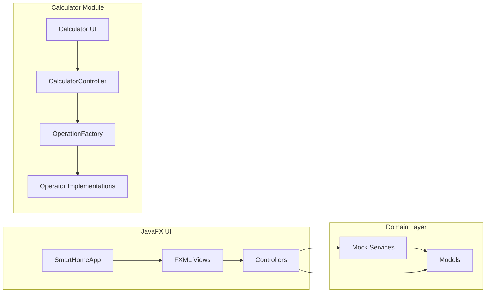
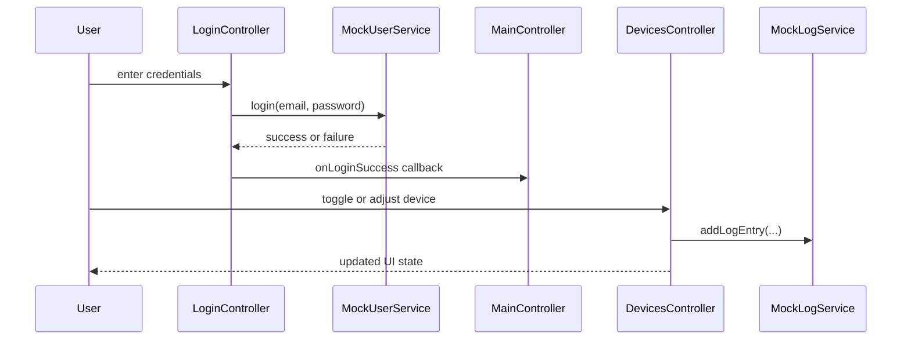

# System Architecture

## System Overview

The repository is a single Maven project that packages a Java 21 desktop application. The dominant subsystem is a JavaFX smart-home orchestrator built around FXML views, controllers, in-memory services, and JavaFX model properties. A smaller calculator subsystem demonstrates factory-based arithmetic logic and has the majority of the current automated tests.

## Architecture Diagram

### Text Alternative

- SmartHomeApp bootstraps FXML views and controller wiring.
- Controllers coordinate screen behavior and call mock services.
- Services expose observable in-memory state built from model classes.
- The calculator UI calls CalculatorController, which delegates arithmetic to a factory and operator implementations.

## Component Descriptions

### Smart Home Application Shell
- **Purpose**: Launch the desktop app and switch between login, registration, and the main shell.
- **Responsibilities**: JavaFX scene lifecycle, controller callback wiring, and root navigation.
- **Dependencies**: JavaFX Application, FXMLLoader, MainController, LoginController, RegisterController.
- **Type**: Application

### Smart Home Controllers
- **Purpose**: Implement per-screen UI behavior.
- **Responsibilities**: Translate FXML events into service calls, update labels and controls, and guard owner-only features.
- **Dependencies**: JavaFX controls, service singletons, model classes.
- **Type**: Application

### Mock Service Layer
- **Purpose**: Centralize application state and behavior with in-memory data.
- **Responsibilities**: Authentication, user administration, device manipulation, notifications, logging, schedules, scenes, simulations, and IoT configuration.
- **Dependencies**: JavaFX observable collections, model classes.
- **Type**: Application/Domain

### Domain Models
- **Purpose**: Represent mutable smart-home state.
- **Responsibilities**: Hold data for devices, rooms, users, logs, scenes, schedules, rules, notifications, and other domain concepts.
- **Dependencies**: JavaFX property classes.
- **Type**: Model

### Calculator Module
- **Purpose**: Provide a smaller arithmetic example with a clear separation of controller and operation logic.
- **Responsibilities**: Accept display state, normalize results, resolve operations, and expose reusable operator behavior.
- **Dependencies**: OperationFactory, operator implementations.
- **Type**: Application

## Data Flow

### Text Alternative

- A user logs in through LoginController, which delegates credential checks to MockUserService.
- After success, MainController loads the main device-management shell.
- Device interactions stay in-memory and are recorded through MockLogService.

## Integration Points
- **External APIs**: None detected. The repository does not expose REST or network APIs.
- **Databases**: None detected. State is held in JavaFX observable collections and in-memory objects.
- **Third-party Services**: A mock MQTT integration service validates broker and port settings and seeds simulated integration devices.

## Infrastructure Components
- **CDK Stacks**: None detected.
- **Deployment Model**: Local desktop execution through Maven packaging and the JavaFX Maven plugin.
- **Networking**: No server-side networking stack detected. Optional mock MQTT settings are stored in memory only.
- **Automation**: GitHub Actions CI compiles, tests, runs PMD, packages the JAR, and uploads artifacts.