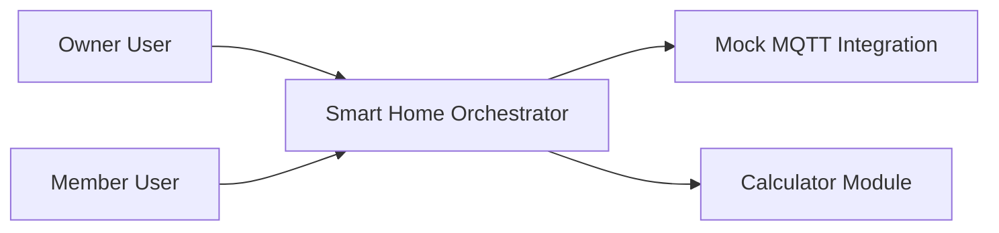

# Business Overview

## Business Context Diagram

### Text Alternative

- Owner and member users interact with the Smart Home Orchestrator desktop application.
- The application exposes a secondary calculator module in the same codebase.
- The smart-home application can validate mock MQTT settings and simulate connected devices.

## Business Description
- **Business Description**: The repository primarily implements a desktop smart-home orchestration application for managing rooms, devices, automation rules, scenes, schedules, users, energy information, activity logs, vacation mode, and IoT integration through mock in-memory services. A smaller calculator module is kept alongside it as a separate teaching example.
- **Business Transactions**:
  - User login and logout
  - User registration
  - View device inventory by room
  - Toggle device state and adjust brightness or temperature
  - Manage rooms
  - Manage rules and automation settings
  - Manage schedules
  - Manage scenes
  - Review activity logs and notifications
  - Manage users and role-restricted functions
  - Configure vacation mode and simulations
  - Configure and test mock IoT integration
  - Run calculator operations through a factory-backed controller
- **Business Dictionary**:
  - **Device**: A controllable smart-home endpoint such as a switch, dimmer, thermostat, sensor, or blind.
  - **Room**: A logical grouping for devices.
  - **Rule**: Automation logic triggered by conditions.
  - **Scene**: A reusable combination of device states.
  - **Schedule**: A time-based automation entry.
  - **Vacation Mode**: A configuration for simulated occupancy or absence handling.
  - **Notification**: A user-visible event raised by the application.
  - **Activity Log**: A chronological record of manual or automated changes.
  - **Integration Device**: A device discovered through the mock MQTT integration layer.

## Component Level Business Descriptions

### at.jku.se.smarthome
- **Purpose**: Hosts the end-user smart-home orchestration experience.
- **Responsibilities**: Start the JavaFX application, load views, control navigation, enforce role-based UI restrictions, and coordinate device-management workflows.

### at.jku.se.smarthome.controller
- **Purpose**: Present user actions and workflows for each smart-home area.
- **Responsibilities**: Handle login, registration, device control, room management, rules, schedules, scenes, energy, settings, user administration, activity logs, vacation mode, simulation, and IoT setup.

### at.jku.se.smarthome.service
- **Purpose**: Provide application data and behavior through in-memory mock services.
- **Responsibilities**: Store domain state, simulate devices and integrations, manage users, log events, and supply observable collections to controllers.

### at.jku.se.smarthome.model
- **Purpose**: Represent domain data shared across controllers and services.
- **Responsibilities**: Model devices, rooms, rules, scenes, schedules, users, logs, notifications, simulation data, and vacation-mode configuration.

### at.jku.se.calculator
- **Purpose**: Provide a separate arithmetic example within the same repository.
- **Responsibilities**: Manage display state, dispatch operations, and drive UI-specific calculator interactions.

### at.jku.se.calculator.factory and at.jku.se.calculator.operators
- **Purpose**: Encapsulate arithmetic operation selection and execution.
- **Responsibilities**: Map user actions to operator implementations and perform calculations.