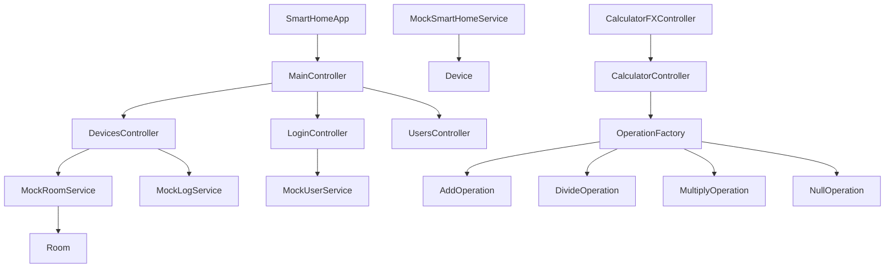

# Code Structure

## Build System
- **Type**: Maven
- **Configuration**: pom.xml defines Java 21 compilation, JavaFX application packaging, JaCoCo reporting, PMD analysis, Log4j dependencies, and JUnit 4 tests.
- **CI Automation**: .github/workflows/Continuous Integration.yaml runs compile, test, coverage publishing, PMD, packaging, and artifact upload on push, pull request, and manual dispatch.

## Key Classes and Modules

### Text Alternative

- SmartHomeApp wires the smart-home UI controllers.
- Controllers depend on singleton mock services and JavaFX models.
- CalculatorFXController depends on CalculatorController, which resolves arithmetic behavior via OperationFactory and operator classes.

## Existing Files Inventory

- `src/main/java/at/jku/se/smarthome/SmartHomeApp.java` - JavaFX entry point and scene bootstrapper for the smart-home application.
- `src/main/java/at/jku/se/smarthome/controller/ActivityLogController.java` - Presents and filters activity log data.
- `src/main/java/at/jku/se/smarthome/controller/DevicesController.java` - Renders device cards and handles direct device interactions.
- `src/main/java/at/jku/se/smarthome/controller/EnergyController.java` - Presents smart-home energy information and summaries.
- `src/main/java/at/jku/se/smarthome/controller/IoTSettingsController.java` - Manages mock MQTT settings and connection testing.
- `src/main/java/at/jku/se/smarthome/controller/LoginController.java` - Handles authentication form interactions.
- `src/main/java/at/jku/se/smarthome/controller/MainController.java` - Controls top-level navigation and role-based UI access.
- `src/main/java/at/jku/se/smarthome/controller/RegisterController.java` - Handles user registration flow.
- `src/main/java/at/jku/se/smarthome/controller/RoomsController.java` - Manages room-related UI interactions.
- `src/main/java/at/jku/se/smarthome/controller/RulesController.java` - Manages automation-rule UI interactions.
- `src/main/java/at/jku/se/smarthome/controller/ScenesController.java` - Manages scene creation and editing workflows.
- `src/main/java/at/jku/se/smarthome/controller/SchedulesController.java` - Manages schedule configuration workflows.
- `src/main/java/at/jku/se/smarthome/controller/SettingsController.java` - Manages general preference UI interactions.
- `src/main/java/at/jku/se/smarthome/controller/SimulationController.java` - Handles simulation and mock state-injection workflows.
- `src/main/java/at/jku/se/smarthome/controller/UsersController.java` - Manages users, invitations, and role-sensitive administration tasks.
- `src/main/java/at/jku/se/smarthome/controller/VacationModeController.java` - Manages vacation mode configuration and display.
- `src/main/java/at/jku/se/smarthome/model/Device.java` - Domain model for smart-home devices with JavaFX properties.
- `src/main/java/at/jku/se/smarthome/model/IntegrationDevice.java` - Domain model for devices discovered through mock IoT integration.
- `src/main/java/at/jku/se/smarthome/model/LogEntry.java` - Domain model for activity-log rows.
- `src/main/java/at/jku/se/smarthome/model/NotificationEntry.java` - Domain model for user-visible notifications.
- `src/main/java/at/jku/se/smarthome/model/Room.java` - Domain model for a room and its associated devices.
- `src/main/java/at/jku/se/smarthome/model/Rule.java` - Domain model for automation rule definitions.
- `src/main/java/at/jku/se/smarthome/model/Scene.java` - Domain model for reusable groups of device states.
- `src/main/java/at/jku/se/smarthome/model/Schedule.java` - Domain model for scheduled automation entries.
- `src/main/java/at/jku/se/smarthome/model/SimulationDeviceState.java` - Domain model for simulated device values and state.
- `src/main/java/at/jku/se/smarthome/model/User.java` - Domain model for user identity, role, password, and status.
- `src/main/java/at/jku/se/smarthome/model/VacationModeConfig.java` - Domain model for vacation mode settings.
- `src/main/java/at/jku/se/smarthome/service/MockEnergyService.java` - Supplies mock energy metrics.
- `src/main/java/at/jku/se/smarthome/service/MockIoTIntegrationService.java` - Stores mock MQTT settings and discovered integration devices.
- `src/main/java/at/jku/se/smarthome/service/MockLogService.java` - Stores and exports activity log entries.
- `src/main/java/at/jku/se/smarthome/service/MockNotificationService.java` - Stores in-app notifications.
- `src/main/java/at/jku/se/smarthome/service/MockRoomService.java` - Maintains room state and room-to-device relationships.
- `src/main/java/at/jku/se/smarthome/service/MockRuleService.java` - Maintains automation-rule state.
- `src/main/java/at/jku/se/smarthome/service/MockSceneService.java` - Maintains scene definitions.
- `src/main/java/at/jku/se/smarthome/service/MockScheduleService.java` - Maintains schedule entries.
- `src/main/java/at/jku/se/smarthome/service/MockSimulationService.java` - Supplies mock simulation behavior and values.
- `src/main/java/at/jku/se/smarthome/service/MockSmartHomeService.java` - Provides base device operations and current-user display state.
- `src/main/java/at/jku/se/smarthome/service/MockUserService.java` - Maintains user accounts, roles, and authentication state.
- `src/main/java/at/jku/se/smarthome/service/MockVacationModeService.java` - Maintains vacation-mode state.
- `src/main/java/at/jku/se/calculator/CalcAction.java` - Enum of supported calculator actions and symbols.
- `src/main/java/at/jku/se/calculator/CalculatorController.java` - Business logic controller for calculator state transitions.
- `src/main/java/at/jku/se/calculator/CalculatorFXController.java` - JavaFX-facing calculator controller.
- `src/main/java/at/jku/se/calculator/SimpleCalculator.java` - Calculator application or UI bootstrap class.
- `src/main/java/at/jku/se/calculator/factory/ICalculationOperation.java` - Calculator operation interface.
- `src/main/java/at/jku/se/calculator/factory/OperationFactory.java` - Resolves arithmetic actions to concrete operation implementations.
- `src/main/java/at/jku/se/calculator/operators/AddOperation.java` - Addition implementation.
- `src/main/java/at/jku/se/calculator/operators/DivideOperation.java` - Division implementation.
- `src/main/java/at/jku/se/calculator/operators/MultiplyOperation.java` - Multiplication implementation.
- `src/main/java/at/jku/se/calculator/operators/NullOperation.java` - Null-object or fallback operation implementation.

## Design Patterns

### MVC with FXML Controllers
- **Location**: smart-home JavaFX package structure and FXML resources.
- **Purpose**: Separate views, event handlers, and domain state.
- **Implementation**: FXML files declare controller classes and bind UI events to controller methods.

### Singleton Service Pattern
- **Location**: Mock service classes in at.jku.se.smarthome.service.
- **Purpose**: Share in-memory state across screens without a DI container.
- **Implementation**: Each service exposes a static getInstance method and a private constructor.

### Factory and Strategy
- **Location**: calculator factory and operators packages.
- **Purpose**: Resolve calculator actions to interchangeable operation implementations.
- **Implementation**: OperationFactory returns objects implementing ICalculationOperation.

### Observer Through JavaFX Properties
- **Location**: Device and other model classes plus controller listeners.
- **Purpose**: Keep UI state synchronized with model changes.
- **Implementation**: JavaFX property objects and ObservableList listeners drive updates.

## Critical Dependencies

### JavaFX 21
- **Usage**: Desktop UI, FXML, scene graph, controls, and property binding.
- **Purpose**: Render the smart-home and calculator interfaces.

### Log4j 2.23.1
- **Usage**: Logging configuration is present in src/main/resources/log4j2.xml.
- **Purpose**: Provide a centralized logging framework, although direct use in application classes is limited.

### JUnit 4.13.2
- **Usage**: Unit tests in the calculator package.
- **Purpose**: Validate calculator controller, factory, and operator logic.

### JaCoCo Maven Plugin 0.8.12
- **Usage**: Coverage reporting during test phase.
- **Purpose**: Produce coverage reports for CI and local analysis.

### Maven PMD Plugin 3.22.0
- **Usage**: Static analysis in local builds and CI.
- **Purpose**: Identify code-quality issues and duplication candidates.