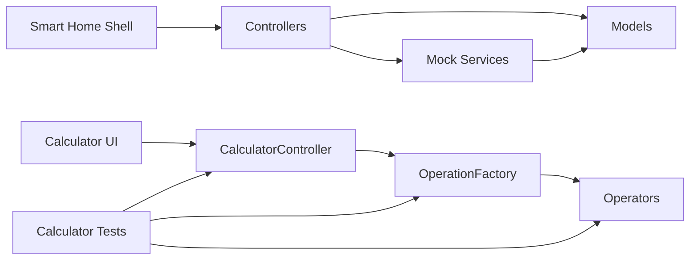

# Dependencies

## Internal Dependencies

### Text Alternative

- Smart-home controllers depend on both service singletons and model classes.
- Mock services depend on the smart-home models.
- The calculator UI depends on CalculatorController, which depends on OperationFactory and concrete operators.
- Existing tests depend almost entirely on calculator classes.

### `at.jku.se.smarthome.controller` depends on `at.jku.se.smarthome.service`
- **Type**: Compile
- **Reason**: Controllers retrieve and mutate application state through singleton mock services.

### `at.jku.se.smarthome.controller` depends on `at.jku.se.smarthome.model`
- **Type**: Compile
- **Reason**: Controllers render and bind model properties directly in JavaFX controls.

### `at.jku.se.smarthome.service` depends on `at.jku.se.smarthome.model`
- **Type**: Compile
- **Reason**: Services store domain entities and expose them as observable state.

### `at.jku.se.calculator` depends on `at.jku.se.calculator.factory`
- **Type**: Compile
- **Reason**: CalculatorController resolves operations through OperationFactory.

### `at.jku.se.calculator.factory` depends on `at.jku.se.calculator.operators`
- **Type**: Compile
- **Reason**: Factory methods create concrete arithmetic operations.

### `src/test/java` depends on calculator packages
- **Type**: Test
- **Reason**: Existing tests target calculator controller, factory, and operators.

## External Dependencies

### JUnit
- **Version**: 4.13.2
- **Purpose**: Unit testing support for calculator logic
- **License**: Upstream license not verified during this reverse-engineering pass

### Log4j API
- **Version**: 2.23.1
- **Purpose**: Logging API dependency
- **License**: Upstream license not verified during this reverse-engineering pass

### Log4j Core
- **Version**: 2.23.1
- **Purpose**: Logging implementation dependency
- **License**: Upstream license not verified during this reverse-engineering pass

### JavaFX Controls
- **Version**: 21
- **Purpose**: UI controls and scene graph components
- **License**: Upstream license not verified during this reverse-engineering pass

### JavaFX FXML
- **Version**: 21
- **Purpose**: FXML loading and controller binding
- **License**: Upstream license not verified during this reverse-engineering pass